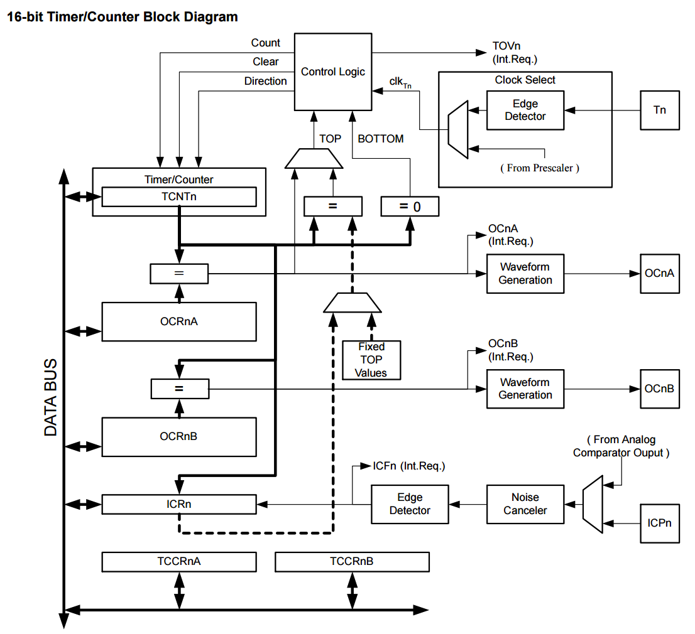

# TIMER ONE (16-BIT) : INTERRUPT & PWM UTILITIES

&nbsp;&nbsp;&nbsp;&nbsp;&nbsp;&nbsp;&nbsp;&nbsp;&nbsp;&nbsp;

&nbsp;&nbsp;&nbsp;&nbsp;&nbsp;&nbsp;&nbsp;&nbsp;&nbsp;&nbsp;

## INTRODUCTION

A set of functions for setting-up and controling Timer 1 on AVR MCU's.

Source: [ATmega328P DATASHEET](http://www.atmel.com/Images/Atmel-42735-8-bit-AVR-Microcontroller-ATmega328-328P_datasheet.pdf)

## LICENSE

[The MIT License (MIT)](https://opensource.org/licenses/MIT)
Copyright (c) 2016 Nadav Matalon

Permission is hereby granted, free of charge, to any person obtaining a copy of this software and associated documentation files (the "Software"), to deal in the Software without restriction, including without limitation the rights to use, copy, modify, merge, publish, distribute, sublicense, and/or sell copies of the Software, and to permit persons to whom the Software is furnished to do so, subject to the following conditions:

The above copyright notice and this permission notice shall be included in all copies or substantial portions of the Software.

THE SOFTWARE IS PROVIDED "AS IS", WITHOUT WARRANTY OF ANY KIND, EXPRESS OR IMPLIED, INCLUDING BUT NOT LIMITED TO THE WARRANTIES OF MERCHANTABILITY, FITNESS FOR A PARTICULAR PURPOSE AND NONINFRINGEMENT. IN NO EVENT SHALL THE AUTHORS OR COPYRIGHT HOLDERS BE LIABLE FOR ANY CLAIM, DAMAGES OR OTHER LIABILITY, WHETHER IN AN ACTION OF CONTRACT, TORT OR OTHERWISE, ARISING FROM, OUT OF OR IN CONNECTION WITH THE SOFTWARE OR THE USE OR OTHER DEALINGS IN THE SOFTWARE.

## ATTRIBUITION

* Code in this library is based on:
* Original code by Jesse Tane for http://labs.ideo.com August 2008
* Modified March 2009 by Jérôme Despatis and Jesse Tane for ATmega328 support
* Modified June 2009 by Michael Polli and Jesse Tane to fix a bug in setPeriod() which caused the timer to stop
* Modified April 2012 by Paul Stoffregen - portable to other AVR chips, use inline functions
* Modified again, June 2014 by Paul Stoffregen - support Teensy 3.x & even more AVR chips
* Modified again, October 2016 by Nadav Matalon 
* Originally published under the under Commons Attribution 3.0 United States License.
* Source code on which present code is based can be found at [PaulStoffregen / TimerOne](https://github.com/PaulStoffregen/TimerOne)